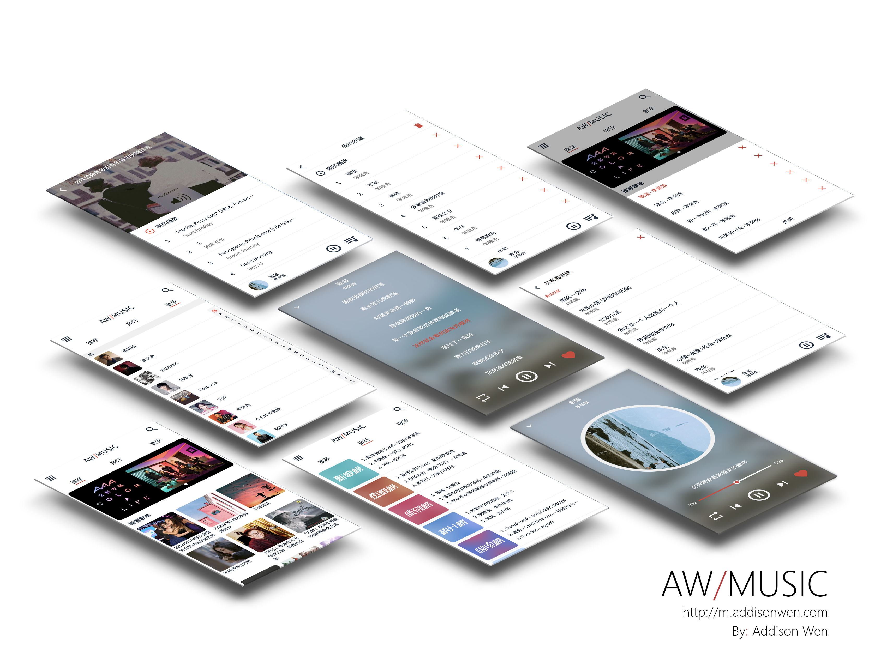
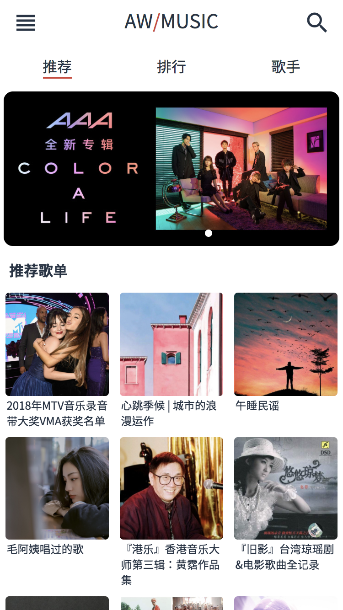
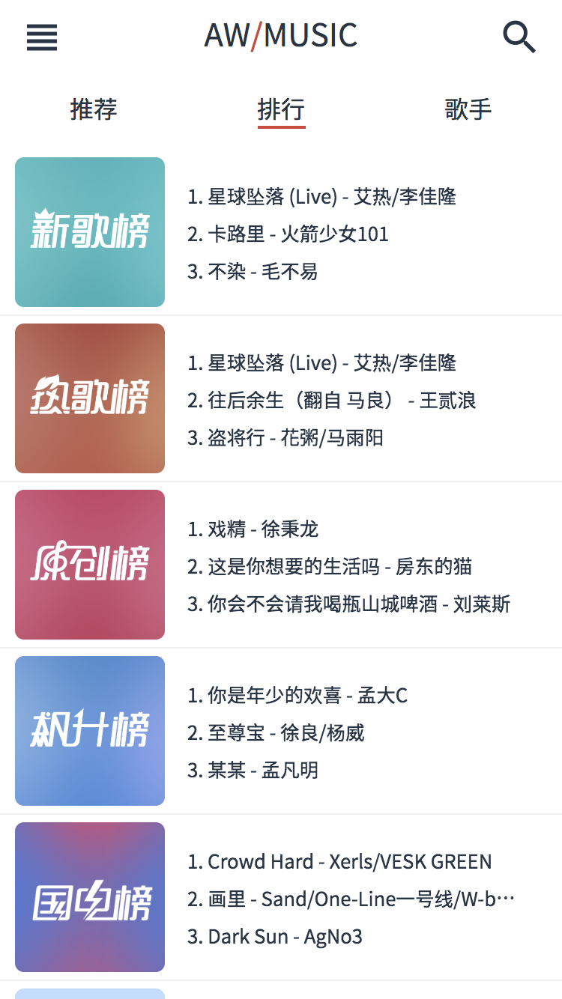
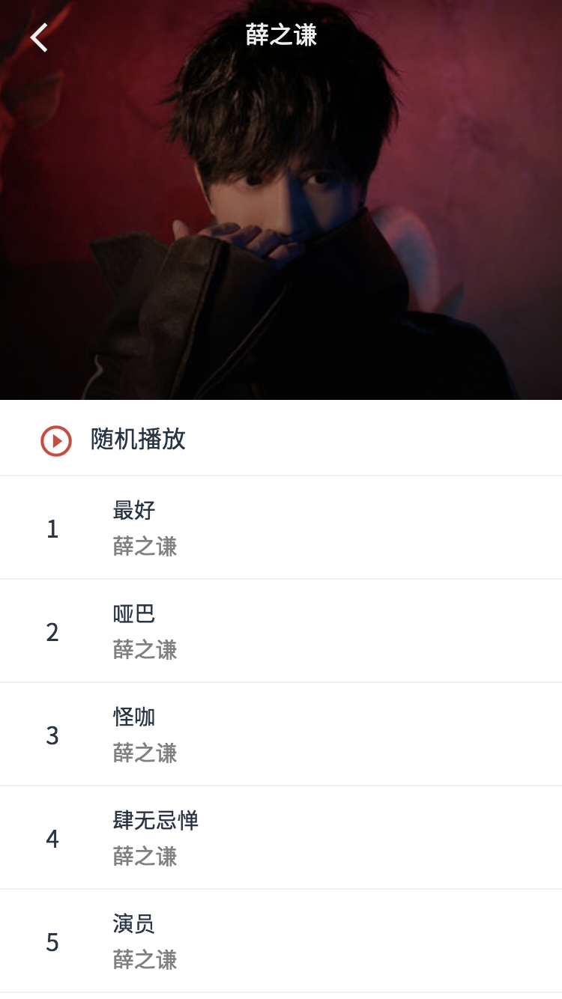
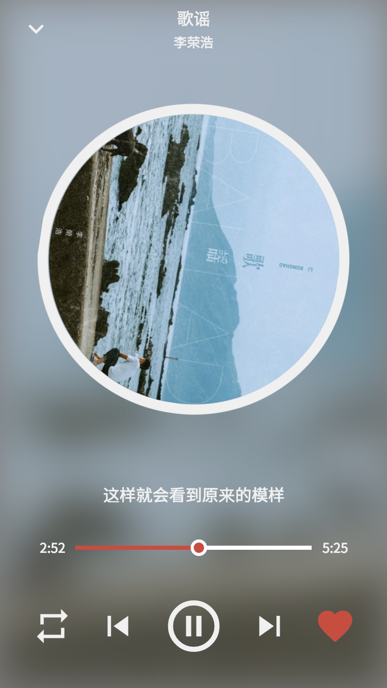
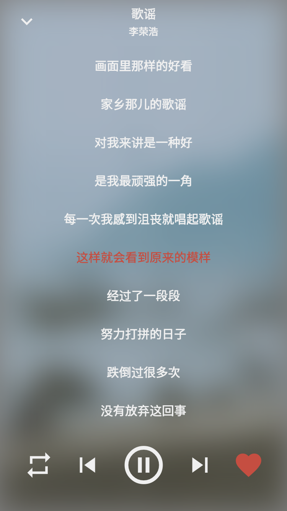
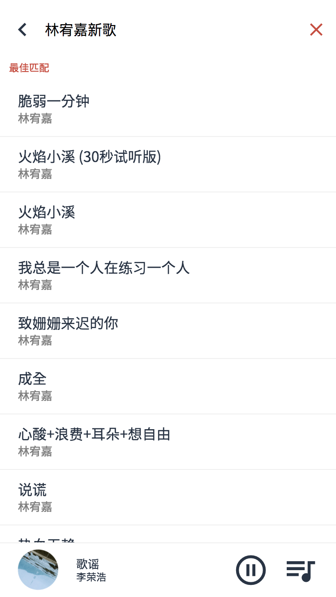
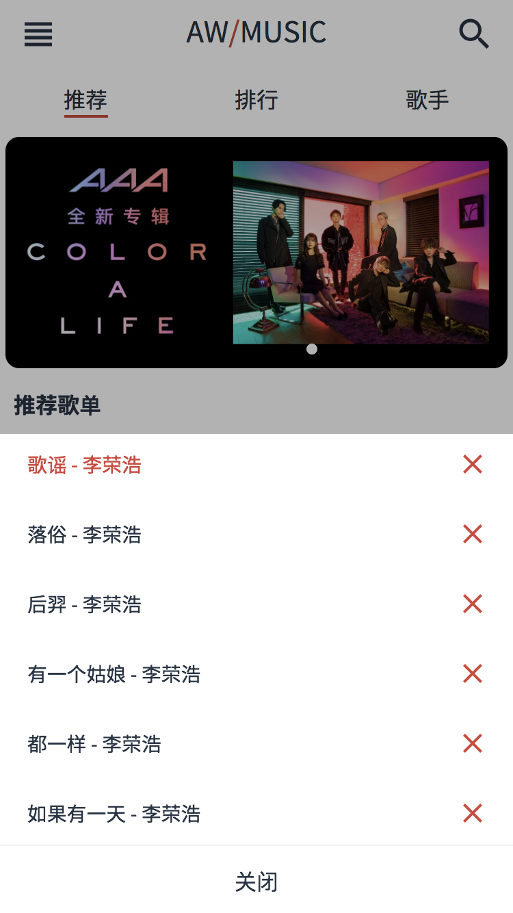
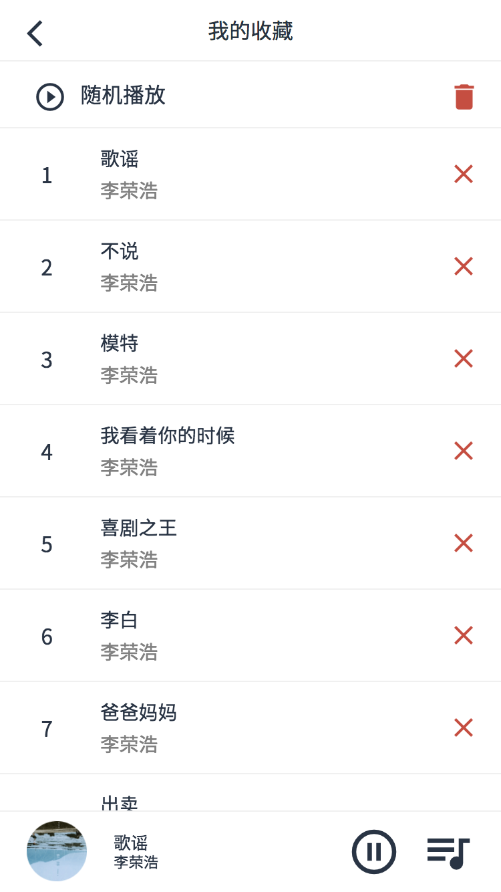

# Vue - AW-MUSIC 网易云 Cloud Music Web App

Demo: [m.addisonwen.com](http://m.addisonwen.com)

*View demo on mobile device or chrome mobile device mode. Refresh the page if page is unscrollable*

*使用移动设备或Chrome移动设备模式访问Demo， 如无法滚动请刷新页面*

## Frontend / 前端
* Vue 2.5.16
* Vue-Router
* Vuex
* Better-Scroll
* Vue-Awesome-Swiper
* Lazyload
* ES6
* SCSS + Flex layout
* Material Icons

## Backend / 后端
* Node.js + Express
* Axios
* NeteaseCloudMusicApi

## Tools / 工具
* Vue-Cli 3
* Eslint
* Fastclick

## Screenshots / 项目截图
### Mockup

### Recommend | Rank

### Artists | Artist Detail

### Player CD | Player Lyrics

### Music List

### Search | Search Result

### Current Play List | Favourite Song List

