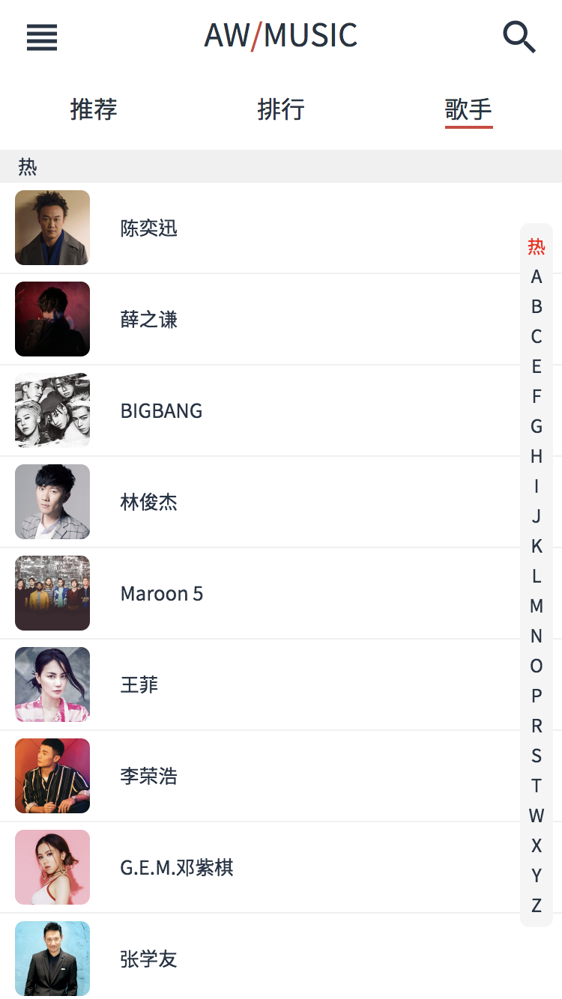

# Vue - AW-MUSIC 网易云 Cloud Music Web App

Demo: [m.addisonwen.com](http://m.addisonwen.com)

*View demo on mobile device or chrome mobile device mode. Refresh the page if page is unscrollable*

*使用移动设备或Chrome移动设备模式访问Demo， 如无法滚动请刷新页面*

## Features
* Browse and play tracks in recommend or music rank playlist.
* Search Artists / Songs by name.
* Brose artists with index scrolling
* Support 3 play modes (Sequence, Loop, Random)
* Song lyrics supported
* Minimal design UI built with SASS + Flex layout.
* Mark favourite songs and storage them in local storage.

## Frontend / 前端
* Vue 2.5.16
* Vue-Router
* Vuex
* Better-Scroll
* Vue-Awesome-Swiper
* Lazyload
* ES6
* SCSS + Flex layout
* Material Icons

## Backend / 后端
* Node.js + Express
* Axios
* NeteaseCloudMusicApi

## Tools / 工具
* Vue-Cli 3
* Eslint
* Fastclick

## Screenshots / 项目截图
### Mockup

### Recommend 推荐页面 | Rank 排行页面
 

### Artists 歌手页面 | Artist Detail 歌手详情
 

### Player CD 播放器 | Player Lyrics 歌词
 

### Music List 歌单页面

### Search 搜索页面 | Search Result 搜索结果
 

### Current Play List 当前播放列表 | Favourite Song List 收藏页面
 
