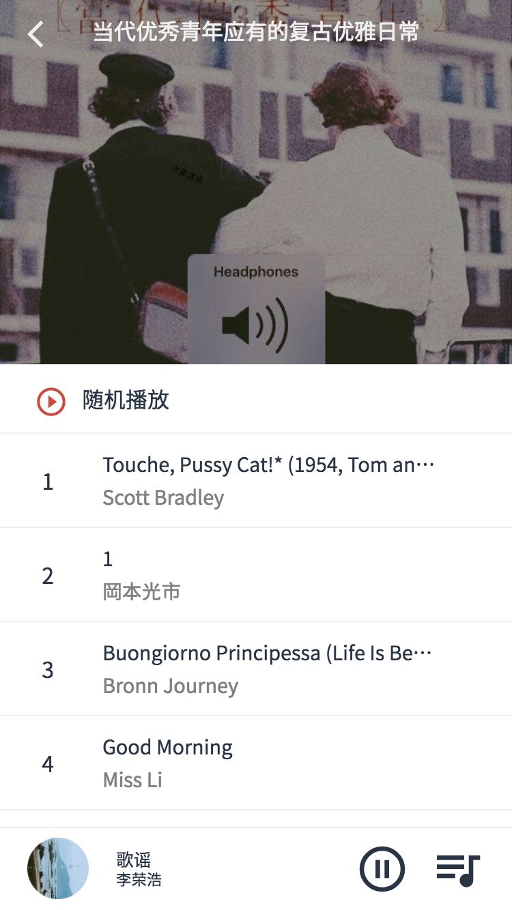

# Vue - Cloud Music Web App

Demo: [m.addisonwen.com](http://m.addisonwen.com)

*View demo on mobile device or chrome mobile device mode. Refresh the page if page is unscrollable*

## Frontend
* Vue 2.5.16
* Vue-Router
* Vuex
* Better-Scroll
* Vue-Awesome-Swiper
* Lazyload
* ES6
* SCSS + Flex layout
* Material Icons

## Backend
* Node.js + Express
* Axios
* NeteaseCloudMusicApi

## Tools
* Vue-Cli 3
* Eslint
* Fastclick

## Screenshots
*Mockup*

*Recommend*

*Rank*

*Artists*

*Artist*

*Player CD*

*Player Lyrics*

*Music List*

*Search*

*Search Result*

*Play List*

*Favourite List*
